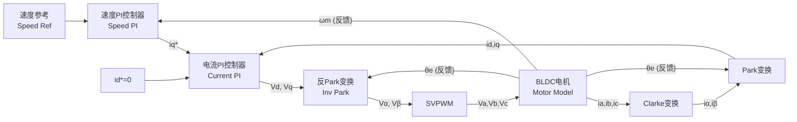

# BLDC FOC 矢量控制仿真系统

这是一个用于无刷直流电机（BLDC）的 FOC（磁场定向控制/矢量控制）仿真项目。项目提供了两种仿真模式：
1. **纯 MATLAB 脚本仿真**：无需 Simulink，直接运行脚本输出波形及电流矢量轨迹，支持快速验证。
2. **Simulink 模型仿真**：包含自动构建脚本，可程序化生成完整的 Simulink 双闭环（速度环 + 电流环）控制模型。

## 系统架构

本项目实现了经典的 **双闭环（速度外环 + 电流内环）FOC 矢量控制系统**，并集成了**有传感器**和**无传感器（滑模观测器 SMO）**两种闭环控制模式。

### 1. 有感 FOC 控制框图


### 2. 无感 FOC 控制框图 (滑模观测器 SMO)
```mermaid
graph TD
    subgraph 控制算法 (Control Algorithms)
        Ref["速度参考 Speed Ref"] --> SpeedPI["速度PI控制器 Speed PI"]
        SpeedPI --> |"iq*"| CurrentPI["电流PI控制器 Current PI"]
        IdRef["id*=0"] --> CurrentPI
        CurrentPI --> |"Vd, Vq"| InvPark["反Park变换 Inv Park"]
        InvPark --> |"Vα, Vβ"| SVPWM["SVPWM"]
    end

    subgraph 物理对象 (Physical Plant)
        SVPWM --> |"Va, Vb, Vc"| Motor["BLDC电机 Motor"]
        Motor --> |"ia, ib, ic"| Clarke["Clarke变换"]
    end

    subgraph 滑模观测器与反馈 (SMO & Feedback Loop)
        Clarke --> |"iα, iβ"| Park["Park变换"]
        Park --> |"id, iq"| CurrentPI

        %% 无感估算回路
        Clarke --> |"iα, iβ"| SMO["滑模观测器 SMO"]
        InvPark --> |"Vα, Vβ"| SMO
        SMO --> |"估计电角度 θ̂e"| InvPark
        SMO --> |"估计电角度 θ̂e"| Park
        SMO --> |"估计转速 ω̂m"| SpeedPI
    end
    
    style SMO fill:#e1f5fe,stroke:#01579b,stroke-width:2px;
```

### 3. 滑模观测器 (SMO) 控制原理
在 $\alpha\beta$ 静止坐标系下，表贴式永磁电机的状态方程为：
$$v_{\alpha} = R_s i_{\alpha} + L_s \frac{d i_{\alpha}}{dt} + e_{\alpha}$$
$$v_{\beta} = R_s i_{\beta} + L_s \frac{d i_{\beta}}{dt} + e_{\beta}$$

其中 $e_{\alpha}$ 和 $e_{\beta}$ 为反电动势（Back-EMF）：
$$e_{\alpha} = -\psi_f \omega_e \sin(\theta_e)$$
$$e_{\beta} = \psi_f \omega_e \cos(\theta_e)$$

SMO 通过构造电流观测器并引入滑动模态项 $z_{\alpha}, z_{\beta}$ 来逼近实际电流，进而提取出反电动势估计值 $\hat{e}_{\alpha}, \hat{e}_{\beta}$：
$$\frac{d \hat{i}_{\alpha}}{dt} = -\frac{R_s}{L_s} \hat{i}_{\alpha} + \frac{1}{L_s}(v_{\alpha} - z_{\alpha})$$
$$\frac{d \hat{i}_{\beta}}{dt} = -\frac{R_s}{L_s} \hat{i}_{\beta} + \frac{1}{L_s}(v_{\beta} - z_{\beta})$$

其中滑模控制函数采用饱和函数（`sat`）以消除颤振：
$$z_{\alpha} = K_{slide} \cdot \text{sat}\left(\frac{\hat{i}_{\alpha} - i_{\alpha}}{\pi}\right)$$
$$z_{\beta} = K_{slide} \cdot \text{sat}\left(\frac{\hat{i}_{\beta} - i_{\beta}}{\pi}\right)$$

通过低通滤波器（LPF）提取反电动势，并引入相位补偿（补偿低通滤波器造成的相位滞后）：
$$\hat{\theta}_e = \text{atan2}(-\hat{e}_{\alpha}, \hat{e}_{\beta}) + \theta_{comp}$$
$$\theta_{comp} = \text{atan2}(\hat{\omega}_e, \omega_{cutoff})$$

---

## 文件结构

| 文件/目录 | 功能描述 |
|:---|:---|
| `run_foc.m` | 🚀 **快速启动脚本** - 交互式菜单入口 |
| `motor_parameters.m` | ⚙️ **参数配置文件** - 配置电机电气、机械参数、PI参数及 SMO 观测器参数 |
| `foc_simulation.m` | 📊 **纯 MATLAB 仿真脚本** - 无需 Simulink 即可运行，输出 9 张波形分析图、电流轨迹及 SMO 观测效果 |
| `build_simulink_model.m` | 🔧 **Simulink 自动构建脚本** - 包含精美的块样式、DropShadow 和 Area 分区 |
| `run_modular_foc_validation.m` | 📈 **Simulink 静默验证脚本** - 运行仿真、统计各项性能指标并导出图片 |
| `foc_functions/` | 📂 **FOC 核心算法函数库** (Clarke、Park、SVPWM、PI 控制器等) |
| `foc_functions/smo_observer.m` | 👁️ **滑模观测器** - 估算反电动势、电角度 $\hat{\theta}_e$ 及电转速 $\hat{\omega}_e$ |

---

## 使用方法

### 方式一：纯 MATLAB 仿真（推荐，无需 Simulink 授权）
在 MATLAB 命令行窗口中，切换至本项目目录并执行：
```matlab
foc_simulation
```
仿真完成后会输出：
1. **FOC控制响应综合图**：转速响应、dq轴电流、三相电流、电磁转矩、SVPWM扇区及占空比等。
2. **电流矢量轨迹图**：$\alpha\beta$ 与 $dq$ 电流稳态轨迹。
3. **SMO 状态分析图**：SMO 估算转速、电角度误差以及估计反电动势。

### 方式二：Simulink 模型构建与交互仿真
在 MATLAB 命令行中执行：
```matlab
run_foc
```
选择 `2` (构建并运行模型) 或 `3` (仅构建模型)。
* 构建脚本会自动生成 `BLDC_FOC_Model.slx`，应用漂亮的颜色区分不同的子系统，并使用 **Area Annotations** 分区，双击即可打开和观察各个模块。

### 方式三：Simulink 模型验证与波形导出 (无 GUI)
选择 `4` 或直接运行 `run_modular_foc_validation`。脚本将：
1. 自动从零构建包含优化界面的 Simulink 模型。
2. 在后台静默运行仿真。
3. 统计稳态速度误差、SMO 角度估算误差等指标，并输出到命令行。
4. 导出高质量的性能曲线图 `modular_foc_waveforms.png`。

---

## 默认电机与控制参数

### 电机参数
- **极对数**：4
- **定子电阻 $R_s$**：0.5 $\Omega$
- **$d/q$ 轴电感**：0.8 mH
- **永磁磁链 $\psi_f$**：0.0175 Wb
- **额定转速/电流**：3000 rpm / 10 A

### 观测器与控制参数
- **PWM 载波频率**：20 kHz (电流环更新频率为 20 kHz，速度环为 2 kHz)
- **SMO 滑模增益 $K_{slide}$**：30 V
- **SMO 饱和边界层**：0.2 A
- **SMO 滤波器截止频率**：反电动势 LPF $2000\text{ rad/s}$，速度 LPF $500\text{ rad/s}$
- **无感切入时间**：$0.02\text{ s}$ (启动初期使用有感做过渡，0.02秒后完全切入无感闭环)
- **仿真时长**：0.5s (0.3s 时突加 0.1 Nm 负载转矩)
