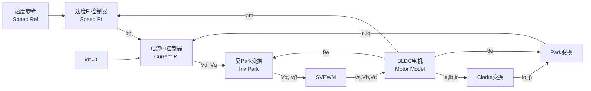

# BLDC FOC 矢量控制仿真系统

这是一个用于无刷直流电机（BLDC）的 FOC（磁场定向控制/矢量控制）仿真项目。项目提供了两种仿真模式：
1. **纯 MATLAB 脚本仿真**：无需 Simulink，直接运行脚本输出波形及电流矢量轨迹，支持快速验证。
2. **Simulink 模型仿真**：包含自动构建脚本，可程序化生成完整的 Simulink 双闭环（速度环 + 电流环）控制模型。

## 系统架构



## 文件结构

| 文件 | 功能 |
|------|------|
| `run_foc.m` | 🚀 **快速启动脚本** - 交互式菜单入口 |
| `motor_parameters.m` | ⚙️ 电机与控制器参数配置文件 |
| `foc_simulation.m` | 📊 纯 MATLAB FOC 仿真主脚本 (输出9张分析图及电流轨迹) |
| `build_simulink_model.m` | 🔧 Simulink 模型自动构建脚本 |
| `safe_clear_subsys.m` | 🛡️ 兼容多版本 Simulink 的子系统清理辅助函数 |

### FOC 核心函数 (`foc_functions/`)
- `clarke_transform.m` - Clarke 变换 ($abc \to \alpha\beta$)
- `park_transform.m` - Park 变换 ($\alpha\beta \to dq$)
- `inv_park_transform.m` - 反 Park 变换 ($dq \to \alpha\beta$)
- `inv_clarke_transform.m` - 反 Clarke 变换 ($\alpha\beta \to abc$)
- `svpwm.m` - 七段式空间矢量脉宽调制 (含过调制处理)
- `pi_controller.m` - 带抗饱和 (Anti-windup) 的 PI 控制器
- `bldc_motor_model.m` - 基于 $d\text{-}q$ 轴数学模型的电机物理仿真

### Simulink 封装函数
- `clarke_park_calc.m` - Clarke & Park 变换封装
- `inv_park_calc.m` - 反 Park 变换封装
- `svpwm_calc.m` - SVPWM 调制算法封装
- `bldc_motor_simulink.m` - 持久化状态的电机模型封装

## 使用方法

### 方式一：纯 MATLAB 仿真（推荐，无需 Simulink 授权）
在 MATLAB 命令行窗口中，切换至本项目目录并执行：
```matlab
foc_simulation
```
仿真完成后会输出：
1. 双闭环控制响应综合图（转速响应、dq轴电流、三相电流、电磁转矩、SVPWM扇区及占空比等）。
2. 电流矢量轨迹图（$\alpha\beta$ 与 $dq$ 电流稳态轨迹）。
3. 命令行输出最终转速、稳态速度误差、稳态电流等指标。

### 方式二：Simulink 模型构建与仿真
在 MATLAB 命令行中执行：
```matlab
run_foc
```
选择 `2` 或 `3`。脚本将程序化地从零添加模块、设置求解器并自动完成所有连线，生成 `BLDC_FOC_Model.slx`。

## 默认电机与控制参数
- **极对数**：4
- **定子电阻 $R_s$**：0.5 $\Omega$
- **$d/q$ 轴电感**：0.8 mH
- **永磁磁链 $\psi_f$**：0.0175 Wb
- **PWM 载波频率**：20 kHz
- **额定转速**：3000 rpm
- **仿真时长**：0.5s (0.3s 时突加 0.1 Nm 负载转矩)
